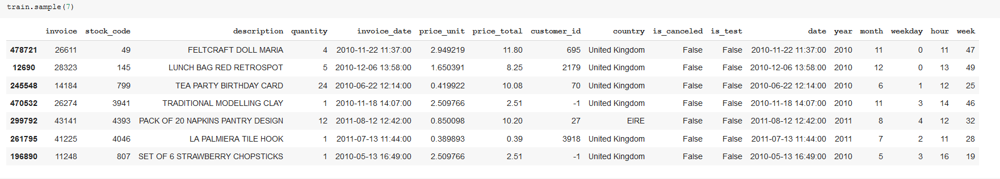
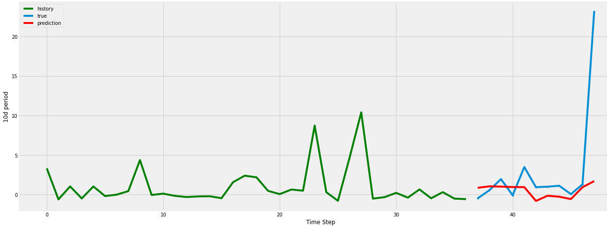
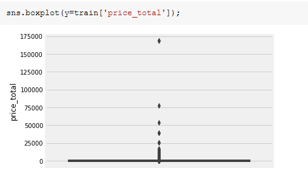
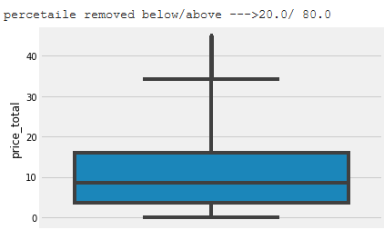
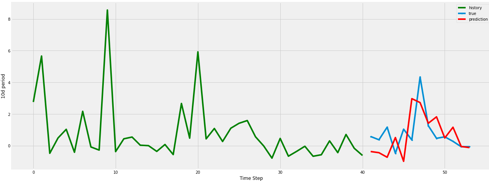
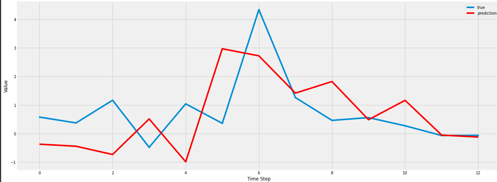

## Project Purpose
Getting familiar with time series data approach and models

### General info
[Time Series](https://en.wikipedia.org/wiki/Time_series) is a collection of data points where indexing is  based on the time points were collected. Often, the data is recorded at regular time intervals. What makes Time Series data special?
Forecasting future Time Series values is a quite common problem in practice. Predicting the weather
for the next week, the price of Bitcoins tomorrow, the number of your sales during X-mas  are common examples.
Time Series data introduces a “hard dependency” on previous time steps, so the assumption that
independence of observations doesn’t hold. What are some of the properties that a Time Series can
have? Stationarity, seasonality, and autocorrelation are some of the properties of the Time Series.

 ###  [time_series_retail.ipynb ](time_series_retail.ipynb)
As an input 2 years  sells data  from one of the online shops were taken and then resampled to 10 day period.
From some intial reasearch seaborn it seemed like particuladays in the week, or weeks in the year could be good good distinguishing point
Other time domains are also tried. Piece of data looks like below:


---
At first try data was taken as is without cleaing ouliers and other bad surprises.
to process simple Keras model with LSTM was used
with a structure as below
```
model = keras.Sequential()
model.add(
  keras.layers.Bidirectional(
    keras.layers.LSTM(
      units=128, 
      input_shape=(X_train.shape[1], X_train.shape[2])
    )
  )
)
model.add(keras.layers.Dropout(rate=0.2))
model.add(keras.layers.Dense(units=1))
model.compile(loss='mean_squared_error', optimizer='adam')

```
###  Results were not particularly impressive:
---




 
structure of dataframe before cleanup:
---


After cleanup  cleanup:



### and results are reasonable...





_Created by:_ [@len-sla]

